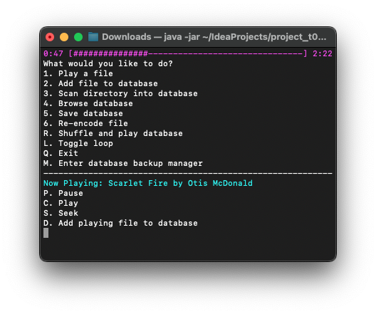

# Chance's CPSC 210 Personal Project

***NOTE 1***: This project expects you have music files to play. Thanks to non-copyright songs, I am able to include a full song for tests; that said, since lossy codecs aren't going to 100% match their lossless counterparts, I'm going to have to add one additional *.wav file for every codec. For just MP3, Vorbis, ALAC, AIFF and WAV this has totaled to >130MB. No doubt by the time I finish up with tests (meaning MP2 and AAC) it'll be even larger. Additionally, due to the audio encoders expecting to dump a file to the filesystem, I will not include automatic testing of the encoders. 
***NOTE 2***: Some seemingly arbitrary classes within non-ui packages won't have tests. The common theme with these classes is that they involve multithreading; I do not know if it is possible to properly test multithreading within CPSC 210 knowledge and as such I cannot test these classes. 
***NOTE 3***: This project saves data at an absolute location in the user's home directory, and it saves filenames as absolute references within the database. The former could be changed, but the latter is required for the database to function if the program is launched from a different location on the filesystem.

## AudioDex 
 
An audiofile (hehe get it?) manager, which can play audio and reencode audio into different formats.

### Plans
- [x] Decode and play audio
  - [x] On a seperate thread so audio playback doesn't kill/stall the main thread if something goes horribly wrong
  - [x] Uses a `getNextSample()` method for all codecs
- [x] Re-encode audio
  - [x] Also on a seperate thread
- [x] Manage a list of music files
  - [x] Includes ID3-based music titles
  - [x] Notes filetype, bitrate, codec and other useful information about the file (cache)
  - [x] Queue files from music list for playback
- [x] ID3 tag management
  - [x] Read ID3 tags
  - [x] Write ID3 tags
    - Tested using AIFF re-encoding
    - Will add full editing capability during GUI stage (aka soon)
  - [x] Read album art
    - GUI resizes the artwork on separate thread to speed up GUI loading (relevant on my 2008 machine)
  - [x] Write album art
- [x] All this, preferably without requiring native binaries
  - I'm going to use libraries to handle decoding and encoding
  
## Filetype Support
### Decode (Library-dependent)
- [x] MP4, M4A, M4B: AAC
  - M4B needs verification (I have none of these files)
- [x] MP3, MP2
  - MP1 is probably decodable as well, but quite literally nobody uses this format so I can't test
- [x] OGG, OGA, MOGG: Vorbis
- [ ] (Probably) AAC
- [x] WAV
- [x] AIFF
- [ ] FLAC
- [x] M4A: ALAC
- [ ] (Maybe) APE
- [ ] (Maybe) WMA

### Encode (Library-dependent)
- [ ] (Hopefully) M4A: AAC
  - MP4 and M4B are redundant formats
- [x] MP3
  - MP2 and MP1 are irrelevant to encode to nowadays, and there are no Java libraries to do so
- [ ] (Hopefully) OGG: Vorbis
- [ ] (Hopefully) AAC
- [x] WAV
- [x] AIFF
- [ ] (Maybe) FLAC
  - [_Found library!_](https://sourceforge.net/projects/javaflacencoder/)
- [ ] (Maybe) M4A: ALAC
- [ ] (Maybe) APE
- [ ] (Maybe) WMA

## Known Issues
- You can't remove audio files from the database via the CLI
  - Only accessible through GUI or removing backend file
- Encoded audio has a comment of "0"
  - Maybe? Major backend changes have occured and I'm unsure of if this still applies
- Slow storage interfaces can cause audio popping
  - Likely due to the decoder being starved for data
  - Doesn't apply to the MP3 audio decoder, which seems to cache the entire file compared to the others streaming the audio off disk
- ALAC vs AAC detection is weird since they share their container, there's no fix for this
  - Similar situation for detection in the OGG container, but there's only one supported playback mode within this container so it's just to avoid throwing errors
- Gain system is partially dependent on format and system
  - No way to fix this, it's entirely dependent on implementation
- Due to no way to test on Windows or Linux, there's no way to test if a system config specific to macOS will crash Windows/Linux systems
  - Specific to GUI interface

## Lucky Breaks
- jaudiotagger handles most of the ID3 metadata I care about
  - jaudiotagger header returns encoding type for *.m4a and *.ogg files
  - jaudiotagger can ***write*** ID3 metadata
    - <big>jaudiotagger can ***write*** album artwork</big>
- `InputStream.read(bytes[] b)` returns the number of bytes actually read
- viva-sound-alac existing
- Tritonus being open-source so I could add in AIFF `swot` support (little endian vs the standard big endian)
  - My code was merged into the only active branch! [See this commit](https://github.com/umjammer/tritonus/commit/37d9111a01c4ee6a8fa505627b4934d19c7e753d)
- JAADec playback example being easy to read so I could figure out what's going on
- mp3spi existing
- Tritonus `AudioOutputStream` supports AIFF out of the box
- java-vorbis-support existing
- The Java port of LAME existing
  - I genuinely didn't think I'd get lossy audio decoding due to library support so that was an insane find
- The port of JDK 11 to Mac OS X 10.6 to 10.11 existing
  - This project might've been dead if not for this
  - [Here's the port](https://github.com/Jazzzny/jdk-macos-legacy)
- GridBagLayout
  - All hail GridBagLayout

_I'm a really lucky person ain't I?_

## User Stories
- As a user, I want to play my music
  - As a user, I want to play my music library nonstop for an extended period of time
  - As a user, I don't expect my music playback history and queue to persist after closing the program
- As a user, I want to be able to convert my music to a different format
- As a user, I want to view, edit, and add songs to my music library, which is a list of songs
  - As a user, I expect my music library to automatically be loaded when I launch the program after importing the first time
  - As a user, I expect my music library to not disappear if I move the application I expect my music library to be stored as a part of my user, and not alongside the application
  - As a user, I expect to be able to revert my music library to a previous version if I do something I didn't intend to do

In effect I'm creating a iTunes competitor. 
I have made a program that I would intentionally go out of my way to use. ~~It's still command line.~~ Wow.
