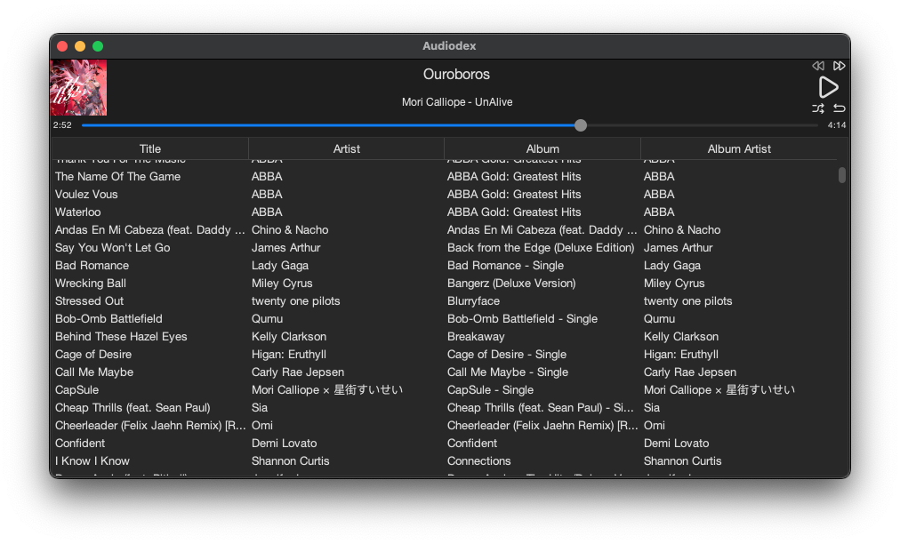

# Chance's CPSC 210 Personal Project

***NOTE 1***: This project expects you have music files to play. Thanks to non-copyright songs, I am able to include a full song for tests; that said, since lossy codecs aren't going to 100% match their lossless counterparts, I'm going to have to add one additional *.wav file for every codec. For the currently implemented tests (all but MP2) this has totaled to around 340MB. No doubt by the time I finish up with tests and adding encoders it'll be even larger.

## AudioDex 
 
An audiofile (hehe get it?) manager, which can play audio and reencode audio into different formats.

### Plans
- [x] Decode and play audio
  - [x] On a seperate thread so audio playback doesn't kill/stall the main thread if something goes horribly wrong
  - [x] Uses a `getNextSample()` method for all codecs
- [x] Re-encode audio
  - [x] Also on a seperate thread
- [x] Manage a list of music files
  - [x] Includes ID3-based music titles
  - [x] Notes filetype, bitrate, codec and other useful information about the file (cache)
  - [x] Queue files from music list for playback
- [x] ID3 tag management
  - [x] Read ID3 tags
  - [x] Write ID3 tags
  - [x] Read album art
    - GUI resizes the artwork on separate thread to speed up GUI loading (relevant on my 2008 machine)
  - [x] Write album art
    - Works in encoders, will add in GUI options later
- [x] All this, preferably without requiring native binaries
  - I'm going to use libraries to handle decoding and encoding
  
## Filetype Support
### Decode (Library-dependent)
- [x] MP4, M4A, M4B: AAC
  - M4B needs verification (I have none of these files)
- [x] MP3, MP2
  - MP1 is probably decodable as well, but quite literally nobody uses this format so I can't test
- [x] OGG, OGA, MOGG: Vorbis
- [x] WAV
- [x] AIFF
- [x] FLAC
  - That was easy
- [x] M4A: ALAC
- [ ] (Maybe) APE
- [ ] (Maybe) WMA

### Encode (Library-dependent)
- [ ] (Hopefully) M4A: AAC
  - MP4 and M4B are redundant formats
- [x] MP3
  - MP2 and MP1 are irrelevant to encode to nowadays, and there are no Java libraries to do so
- [ ] (Hopefully) OGG: Vorbis
- [x] WAV
- [x] AIFF
- [ ] (Maybe) FLAC
  - [_Found library!_](https://sourceforge.net/projects/javaflacencoder/)
- [ ] (Maybe) M4A: ALAC
- [ ] (Maybe) APE
- [ ] (Maybe) WMA

## Known Issues
- You can't remove audio files from the database via the CLI
  - Only accessible through GUI or removing backend file
- Slow storage interfaces can cause audio popping
  - Likely due to the decoder being starved for data
  - Doesn't apply to the MP3 audio decoder, which seems to cache the entire file compared to the others streaming the audio off disk
- ALAC vs AAC detection is weird since they share their container, there's no fix for this
  - Similar situation for detection in the OGG container, but there's only one supported playback mode within this container so it's just to avoid throwing errors
- ~~Gain system is partially dependent on format and system~~
  - ~~No way to fix this, it's entirely dependent on Java and OS implementation~~
  - Pops up a quality error if it can't use gain (and then it'll crudely discard bits to make it work)
- ~~Sometimes hi-res audio, 24 bit samples, will fail to play~~
  - ~~Entirely OS and JDK dependent~~ Will pop up a quality error if it can't play (and then crudely discard bits to make it work)
  - Theoretically possible for 16 bit samples, but no implementation is going to gut that functionality (that's the standard for... EVERYTHING)
- If audio encodes too fast, it ends up skipping some code (AudioEncoder.encodedPercent never is checked during encoding) That said you'd have to decode an ALAC file at over 1400 times realtime, which... good luck.

## Lucky Breaks
- jaudiotagger handles most of the ID3 metadata I care about
  - jaudiotagger header returns encoding type for *.m4a and *.ogg files
  - jaudiotagger can ***write*** ID3 metadata
    - <big>jaudiotagger can ***write*** album artwork</big>
- `InputStream.read(bytes[] b)` returns the number of bytes actually read
- viva-sound-alac existing
- Tritonus being open-source so I could add in AIFF `swot` support (little endian vs the standard big endian)
  - My code was merged into the only active branch! [See this commit](https://github.com/umjammer/tritonus/commit/37d9111a01c4ee6a8fa505627b4934d19c7e753d)
- JAADec playback example being easy to read so I could figure out what's going on
- mp3spi existing
- Tritonus `AudioOutputStream` supports AIFF out of the box
- java-vorbis-support existing
- The Java port of LAME existing
  - I genuinely didn't think I'd get lossy audio decoding due to library support so that was an insane find
- The port of JDK 11 to Mac OS X 10.6 to 10.11 existing
  - This project might've been dead if not for this
  - [Here's the port](https://github.com/Jazzzny/jdk-macos-legacy)
- GridBagLayout
  - All hail GridBagLayout
- [Dazzle UI Icons](https://dazzleui.pro/library/)

_I'm a really lucky person ain't I?_

## User Stories
- As a user, I expect to be able to play my music
  - As a user, I expect to be able to play my music library nonstop for an extended period of time
  - As a user, I don't expect my music playback history and queue to persist after closing the program
- As a user, I want to be able to convert my music to a different format
  - As a user, I want to be able
- As a user, I expect to be able to view, edit, and add songs to my music library, which is a list of songs
  - As a user, I expect my music library to automatically be loaded when I launch the program after importing the first time
  - As a user, I expect my music library to not disappear if I move the application I expect my music library to be stored as a part of my user, and not alongside the application
  - As a user, I expect to be able to revert my music library to a previous version if I do something I didn't intend to do
  - As a user, I want to be able to edit the metadata of my songs

## Grader Instructions

My program is designed to be as intuitive and simple as possible. If you've used iTunes, the program should feel fairly familiar (excluding the lack of drag-and-drop for files). 
Both actions involving adding to the (theoretically infinite) list of files are located in the "Database" dropdown menu. You can either import a individual song, or tell the program to import the contents of a directory. Additionally, right clicking on any individual song allows it to be individually removed from the list. The ability to save the state of the application is also located in this menu, as is the ability to load a state other than the automatically loaded one using the "Change Database" button in the "Database" menu. 
The only visual element outside of the (many) SVG icons that are loaded by the program is visible on the top left part of the main window. When you play a song, it will automatically load the album artwork from the file and display it in place of the music note located there. 
To put in in terms of the template:

- There are many SVG files used in my program; there is a chance these fail to load, and if they do, the GUI will become unresponsive. This is a bug within one of the libraries I use, and the only fix is to restart the program. If this happens, the GUI will be visibly broken. The primary visual element can be located in the top left corner of my program, when a song is played; if there is album artwork embedded in the file, it will load this artwork and display it there in place of the default music note.
- You can generate the required actions relating to the user story of "As a user, I expect to be able to view, edit, and add songs to my music library, which is a list of songs" by:
  - Using the "Add file to database" button in the "Database" menu to add an indivdual song to the song list.
  - Using the "Add directory to database" button in the "Database" menu to add the contents of a directory to the song list.
  - Right clicking on a song in the list and selecting the "Remove song" button to remove a song from the song list.
  - Right clicking on a song in the list and selecting the "Edit metadata" button to edit the metadata of a song.
- You can save the state of my application using the "Save database" button in the "Database" menu; this saves a new file in the active directory and updates the index the program will load (rationale for this in next point).
- The application will automatically attempt to load the most recently saved file within the default directory, which is set to `(user home)/audiodex`; this can be changed using the "Change Database" button in the "Database" menu. Using this button will allow you to change the active directory. This will make the program attempt to load the most recently saved database located in that directory; if there is none, it will initalize a new database. I use a directory instead of an individual file to make rolling back the database in case of a failed save fairly easy, as it could be difficult or slow to import hundreds of songs. Which file is loaded is determined by the file `index.audiodex.db`, which is used to both detect if a database is present, and also to determine which JSON file to load (it stores a 64-bit index in base 36)
